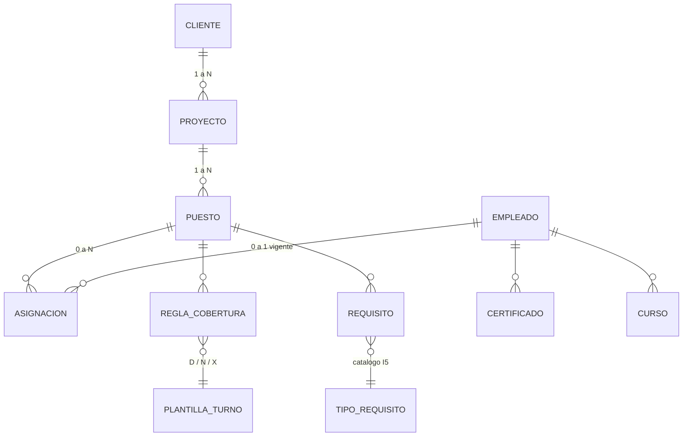
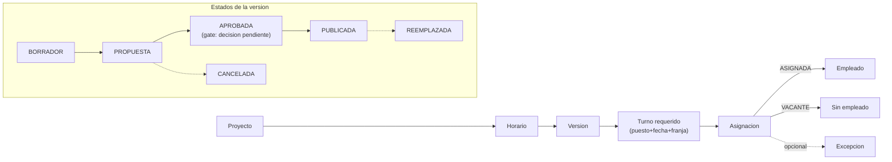

# Modelo Funcional De Entidades - Base Para Pruebas Funcionales

**Fecha:** 2026-09-12
**Producto:** S&G Super App
**Alcance:** I2 (datos maestros), I3 (puestos y asignaciones), I4 (certificaciones), I5 (cursos/acreditaciones), I9 (programacion de turnos)
**Proposito:** documentar la jerarquia real de entidades tal como esta construida hoy en `db/migrations/002` a `010`, como referencia para diseñar casos de prueba funcional. No es una decision de arquitectura nueva ni cambia ninguna regla existente.

**Version interactiva (diagramas SVG, con leyenda de reglas de negocio):** https://claude.ai/code/artifact/1b712674-8c50-43a8-bc53-b2834904348c

## 1. Jerarquia comercial y de cumplimiento

Un cliente agrupa proyectos; un proyecto agrupa puestos de servicio; el puesto
define su propia cobertura (plantilla de turno) y sus propios requisitos. El
empleado (guarda) es independiente de esa cadena comercial: se liga a un
puesto por asignacion, y acumula certificados/cursos por su cuenta, sin
depender del puesto que ocupe.

### Reglas de negocio relevantes para pruebas

| Regla | Donde vive | Como probarla |
|---|---|---|
| Un empleado no puede tener dos asignaciones `VIGENTE` a la vez | `uq_employee_position_assignments_active_employee` | Crear una asignacion vigente y luego intentar crear una segunda sin cerrar la primera |
| No se asigna a un puesto inactivo | trigger `enforce_active_service_position_assignment()` | Inactivar un puesto y luego intentar crear una asignacion `VIGENTE` sobre el |
| Cliente/proyecto no se borran si tienen hijos | FK `ON DELETE RESTRICT` (`service_projects_client_id_fkey`, `fk_service_positions_project`) | Intentar borrar un cliente con proyectos, o un proyecto con puestos |
| Certificados y cursos no dependen del puesto | `labor_certificates.employee_id`, `employee_training_records.employee_id` | Retirar la asignacion de un empleado y confirmar que su historial de certificados/cursos sigue visible |

## 2. Ciclo de vida de una programacion de turnos (I9)

Generar, aprobar y publicar son tres pasos separados y deliberados sobre la
misma version — nunca automaticos. Una vez `PUBLICADA`, la version queda
inmutable a nivel de base de datos (`reject_published_schedule_version_change()`).

**Nota de contexto (sin tocar):** hoy ninguna version de un periodo de 30 dias
reales puede llegar a `APROBADA` — el gate `RequireEveryRuleDecidedAsync`
rechaza la version si existe cualquier veredicto `BLOCKED`, este o no ligado a
una asignacion real. Ver `README.md` (Gate Actual, I9) y
`docs/reports/2026-08-31-sg-superapp-i9-piloto-real-anonimizado.md` (seccion
6, punto 15) para el detalle completo. Esta es una decision de diseño
pendiente de Operaciones/Producto, no una tarea de ingenieria — no se modifica
en este documento ni en la sesion que lo genero.

### Reglas de negocio relevantes para pruebas

| Regla | Donde vive | Como probarla |
|---|---|---|
| Un turno requerido describe una necesidad, no un empleado | `required_shifts` vs `schedule_assignments` | Generar una propuesta y confirmar que cada `required_shift` produce exactamente una `schedule_assignment`, `ASIGNADA` o `VACANTE` |
| Solo una version publicada por horario | `schedule_versions_one_published_per_schedule` (indice unico) | Publicar una version y verificar que no se puede publicar una segunda para el mismo horario sin reemplazar la primera |
| Publicada = inmutable | trigger `reject_published_schedule_version_change()` / `reject_published_schedule_assignment_change()` | Intentar editar una asignacion de una version `PUBLICADA` y confirmar el rechazo |

## 3. Referencia rapida entidad -> tabla -> modulo

| Entidad funcional | Tabla(s) en Postgres | Modulo / incremento |
|---|---|---|
| Cliente | `clients` | Programacion de turnos · I9 |
| Proyecto | `service_projects` | Programacion de turnos · I9 |
| Puesto de servicio | `service_positions` | Puestos de servicio · I3 (`project_id` agregado en I9) |
| Empleado / guarda | `employees`, `employee_salary_history` | Empleados / Guardas · I2 |
| Asignacion a puesto | `employee_position_assignments` | Puestos de servicio · I3 |
| Plantilla de turno | `shift_templates`, `shift_template_steps` | Programacion de turnos · I9 |
| Regla de cobertura | `position_coverage_rules` | Programacion de turnos · I9 |
| Requisito de puesto | `position_requirements`, `training_requirement_types` | Cursos y acreditaciones · I5 / I9 |
| Certificado laboral | `labor_certificates`, `certificate_signers` | Certificaciones laborales · I4 |
| Registro de curso | `employee_training_records` | Cursos y acreditaciones · I5 |
| Excepcion de disponibilidad | `employee_availability_exceptions` | Programacion de turnos · I9 |
| Horario / Version | `schedules`, `schedule_versions` | Programacion de turnos · I9 |
| Turno requerido | `required_shifts` | Programacion de turnos · I9 |
| Asignacion de turno | `schedule_assignments` | Programacion de turnos · I9 |
| Excepcion de turno | `schedule_exceptions` | Programacion de turnos · I9 |

**Fuera de este modelo, a proposito:** Alertas/Notificaciones (I6) y Auditoria
(I7) son transversales — leen eventos de todas estas tablas pero no agregan
entidades a la jerarquia de negocio. Cargas de datos (I2, `import_batches`) es
el punto de entrada de Empleado, no una entidad funcional del negocio.

## 4. Fuentes

- `db/migrations/002_employee_master.sql`
- `db/migrations/005_i3_service_positions_assignments.sql`
- `db/migrations/006_i4_labor_certificates.sql`
- `db/migrations/007_i5_training_accreditations.sql`
- `db/migrations/009_i9_scheduling.sql`
- `db/migrations/010_i9_schedule_versions.sql`
